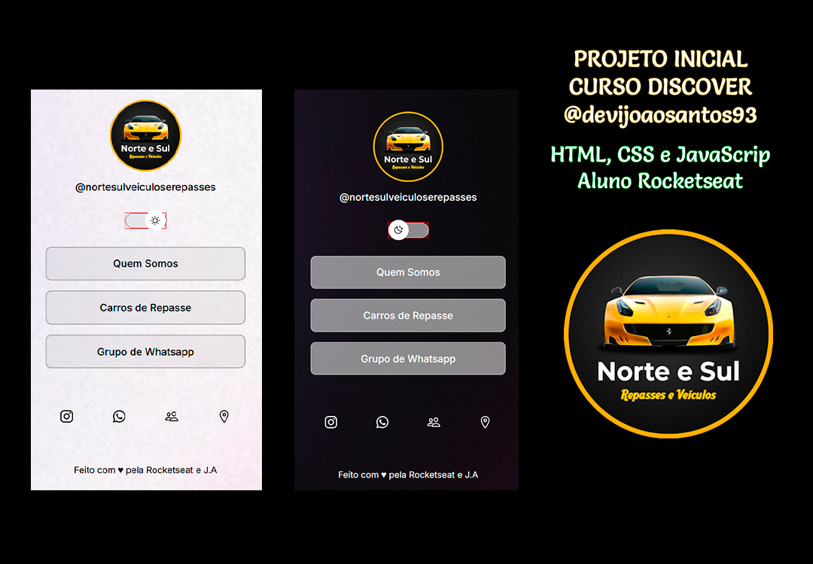

<h1 align="center"> Norte e Sul Veículos e Repasses </h1>

Empresa de venda de veículos novos e usados.  
<a href="https://www.instagram.com/nortesulveiculoserepasses/">Conheça o Instagram da loja aqui.</a>

 

  

## 🚀 Tecnologias

Esse projeto foi desenvolvido com as seguintes tecnologias:

- HTML e CSS
- JavaScript
- Git e Github
- Figma

## 💻 Projeto

Desenvolvimento da pagina WEB Norte e Sul Veículos e Repasses.

## 🔖 Layout

Você pode visualizar o layout do projeto através [DESSE LINK](https://www.figma.com/community/file/1187422022288947321). É necessário ter conta no [Figma](https://figma.com) para acessá-lo.

## :memo: Licença

Esse projeto está sob a licença MIT.
---

Feito com ♥ by Rocketseat e J.A [Participe da nossa comunidade!](https://discord.gg/rocketseat)
